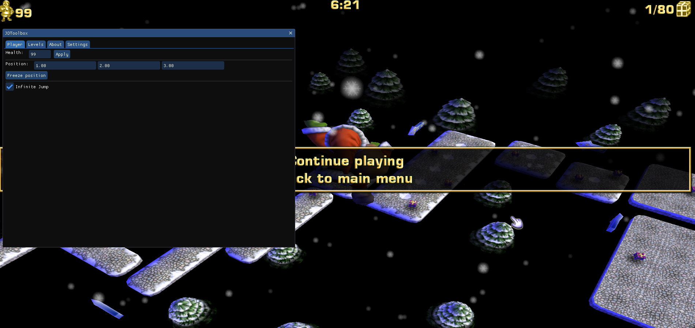

# JDToolbox

This is a very early development project. The goal is to create a cheat menu (and possibly more, like a custom level loader) for Joymania's games.

Building the project creates a `dinput8.dll` file, which you can put in the same folder as the game's executable. When the game is launched, the DLL will be loaded automatically.
A very basic ImGui menu is already implemented. Currently, the only working features are editing player health and infinite jump in SC.

I haven't decided on a name for the project yet, so for now it's just "JDToolbox". The name will probably change in the future.

## todo

- find missing offsets using CE (infinite jump, player position & velocity, present amount)
- remove usages of `IsBadReadPtr` and `IsBadWritePtr`
- use CMake FetchContent for imgui instead of vendoring it
- fix weird crash in proton (`if (auto module = GetModuleHandleW(L"ntdll.dll"); module && GetProcAddress(module, "wine_get_version"))` to check for wine/proton)
- add OldPhysics toggle SCHD (maybe this is too hard idk)
- decide where to put log files (use spdlog?). for SCHD we can just put it in the same folder as the executable, but for the older games we might have to put them into temp or appdata.
  the problem with the older games is that they aren't on Steam, so the default ACLs are inherited from Program Files, preventing us from writing to the game folder.
  try writing to current dir for log, then TEMP
- add outro skipper

### ui stuff

- add imgui log view, and new function `Log(string& msg, bool shouldLogToFileAswell)`. ImGui Demo has this.
- game overlay (hotkey + cursor grab) instead of separate window (switching to docking branch might be enough, otherwise we'll have to hook directx stuff)
- fix roboto not having a name in font selector
- put demo window in separate window (ImGui::Begin)
- svg / png icon font (fontawesome) scalable vector icon (lucide icons?)
- load image using stb_image, create dx texture, ImGui::Image((void*)myTex, ImVec2(w,h))

## fixing overlay popup resources

current best thing i could accomplish is non-resizable popup window

https://learn.microsoft.com/en-us/windows/win32/winmsg/wm-size

https://learn.microsoft.com/en-us/windows/win32/api/winuser/nf-winuser-showwindow

External D3D11 Imgui popup window example https://github.com/adamhlt/ImGui-Standalone

example of handling window resizing: https://github.com/ocornut/imgui/issues/1287

remove background window so only imgui gui window is visible: https://www.unknowncheats.me/forum/direct3d/574826-delete-background-window-dear-imgui-dx11.html and https://www.unknowncheats.me/forum/general-programming-and-reversing/448798-display-imgui-background-wnd.html

useful stuff: https://stackoverflow.com/questions/70404878/imgui-without-window
